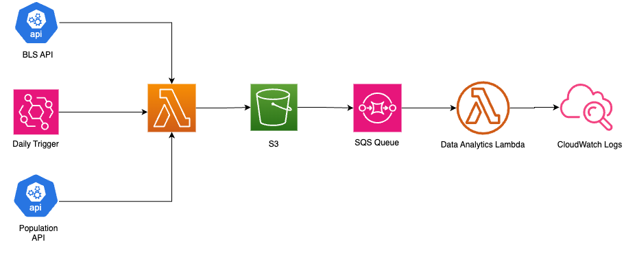

# Rearc Data Quest

Below are the following steps I took when working on [rearc-data/quest](https://github.com/rearc-data/quest).

## Part 1: AWS S3 & Sourcing Datasets

> 1. Republish [this open dataset](https://download.bls.gov/pub/time.series/pr/) in Amazon S3 and share with us a link.

- Created a public bucket on Amazon S3 named [rearc-thirdparty-datahub-us-east-2](https://us-east-2.console.aws.amazon.com/s3/buckets/rearc-thirdparty-datahub-us-east-2?region=us-east-2&bucketType=general&tab=objects).
- Extracted datasets from the above BLS API to the S3 bucket under the folder [bls/](https://us-east-2.console.aws.amazon.com/s3/buckets/rearc-thirdparty-datahub-us-east-2?region=us-east-2&bucketType=general&prefix=bls/&showversions=false).
- Adjusted permissions by disabling "Block public access" and modified the bucket policy. Here's the bucket policy allowing all users ("Principal": "") to perform various actions (such as listing, getting, putting, tagging, and deleting objects) on the specified Amazon S3 bucket:

```json
{
    "Version": "2012-10-17",
    "Statement": [
        {
            "Sid": "AddPerm",
            "Effect": "Allow",
            "Principal": "*",
            "Action": [
                "s3:ListBucket",
                "s3:GetObject",
                "s3:PutObject",
                "s3:PutObjectTagging",
                "s3:PutObjectAcl",
                "s3:DeleteObject"
            ],
            "Resource": [
                "arn:aws:s3:::rearc-thirdparty-datahub-us-east-2",
                "arn:aws:s3:::rearc-thirdparty-datahub-us-east-2/*"
            ]
        }
    ]
}
```

- To address potential 403 Forbidden errors when accessing the data programmatically, I followed Hint-2 in the README, which suggested providing my email to verify that a human, not a robot, is accessing the data. I added my email to the headers with the following format: 
  
```json

headers = {"User-Agent": "MyDataDownloader (xxx@gmail.com)"}

```

> 2. Script this process so the files in the S3 bucket are kept in sync with the source when data on the website is updated, added, or deleted.

- Created a Lambda function with the following Python script `bls_data_sync.py` to sync data source with S3 bucket.
- To set up the virtual environment (venv), I created a requirements.txt file in the specified path, then compressed it into a .zip file and uploaded it as a layer in the AWS Lambda function following the steps outlined below:
  - mkdir our-lambda-layer && cd our-lambda-layer
  - mkdir -p aws-layer/python/lib/python3.9/site-packages
  - nano requirements.txt 
    - `boto3`
    - `bs4`
    - `requests`
  - pip3.9 install -r requirements.txt --target aws-layer/python/lib/python3.9/site-packages
  - ls
  - cd aws-layer
  - zip -r9 lambda-layer.zip .
- Load this lambda-layer initially into S3 bucket, then provide the path while adding the custom layer in Lambda.
- Also, made sure that my local environment python version syncs with AWS Lambda python version.
  
> 3. Don't rely on hard coded names - the script should be able to handle added or removed files.

- The code iterates through all `a` elements in the HTML soup without specifying file names, and extracting the text as the file name, and downloads each file from the BLS API, excluding the '[To Parent Directory]' link.

> 4. Ensure the script doesn't upload the same file more than once.

- Since files in the data source and their corresponding S3 object keys share the same name, the script's logic prevents redundant uploads, ensuring uniqueness and facilitating identification of existing files within the S3 bucket based on the unique object keys.
- In addition, the script remove S3 files that don't exist in data source.
- You can find this script under `part1/bls_data_sync.py`.
  

## Part 2: APIs

> 1. Create a script that will fetch data from [this API](https://datausa.io/api/data?drilldowns=Nation&measures=Population). You can read the documentation [here](https://datausa.io/about/api/)

- Created an another Lambda function with Python script `population_sync.py` to fetch and upload API data to S3 under the folder population/.

> Save the result of this API call as a JSON file in S3.

- Later in part-4, since both part-1 and part-2 need to be merged into one lambda function, noticed that the script from part 1 would remove the JSON file in S3 since it doesn't exist on the first data source website, so I added an exception in for the object `population.json` to not remove this file while processing.
- Similar to part-2, used packages `boto3` and `requests` to fetch the API data and upload it as a JSON file to S3.
- You can find this script under `part2/population_sync.py`.

## Part 3: Data Analytics

### Step 0

> Load both the csv file from Part 1 pr.data.0.Current and the json file from Part 2 as dataframes (Spark, Pyspark, Pandas, Koalas, etc).

- I created an AWS SageMaker notebook named "data-analytics-pt3.ipynb" to facilitate reading data files from S3.
- Initally, converted the pr.data.0.Current to csv file first and loaded both pr.data.0.Current.csv and population.json into two different dataframes

### Step 1

> Using the dataframe from the population data API (Part 2), generate the mean and the standard deviation of the US population across the years [2013, 2018] inclusive.

- Applied a filter to extract population data falling within the inclusive year range of 2013 to 2018.
- Employed the astype() function to convert the data type of the `Years` column from `object` `dtype` to `int` using `astype()` .
- Calculated the mean and standard deviation using the `mean()` and `std()`  functions respectively on the population data within the filtered dataframe.

### Step 2

> Using the dataframe from the time-series (Part 1), For every series_id, find the best year: the year with the max/largest sum of "value" for all quarters in that year. Generate a report with each series id, the best year for that series, and the summed value for that year.

- Utilized the [`rename()`] function to eliminate leading and trailing whitespaces from the original column names series_id and value.
- Employed [`groupby()`] along with sorting values to retain only the year with the maximum summed value for each series.
  
### Step 3

> Using both dataframes from Part 1 and Part 2, generate a report that will provide the value for series_id = PRS30006032 and period = Q01 and the population for that given year (if available in the population dataset).

- Filtered the series dataframe based on the provided `series_id` and `period`.
- Extracted the population data from the `population`  dataframe and converted its `Year` column to integer type for merging purposes.
- Merged and filtered the results to display population data where available.

### Step 4

> Submit your analysis, your queries, and the outcome of the reports as a .ipynb file.

`data_analytics_pt3.ipynb` is located in the `part3` directory.

## Part 4: Infrastructure as Code & Data Pipeline with AWS Terraform / AWS CDK / AWS CloudFormation

### Step 0

- Used AWS CloudFormation to create a template for an automated data pipeline on AWS.

### Step 1

- Combined part 1 and part 2 scripts into one lambda function named as `daily_data_sync_lambda` for daily API data sync with an S3 bucket for storage and access.
- You can find the script in `/part4/daily_data_sync_lambda.py`.
- Also, make sure to configure the 'Timeout' parameter to 1 min under `Configuration` -> `General Configuration` 
in the Lambda function in order prevent the timeout error while fetching the data.

### Step 2

- First set up a `SQS Queue` named as `PopulationQueue` in AWS SQS Console by following [this article](https://docs.aws.amazon.com/AWSSimpleQueueService/latest/APIReference/API_CreateQueue.html)
- Next, set up an S3 event notification everytime `population.json` is updated/written to S3, which adds to an SQS queue. 
- Followed the Hint-3 i.e.S3 notifications event and created an event notification under S3 properties by following steps:
- Here are the simple steps to create an event notification in S3 when a file named population.json arrives:

  - Open S3 Console: Go to the AWS Management Console and open the S3 service.
  - Select Bucket: Choose the bucket along with the folder name where you want to set up the notification.
  - Click on Properties: Click on the bucket name, then select the "Properties" tab.
  - Create Event Notification: Scroll down to the "Events" section and click on "Create event notification".
  - Configure Event: Choose "All object create events" as the event type.
  - Add Filter: Add a filter to specify the file name as population.json.
  - Choose Destination: Select where you want the notification to be sent, in this case it would be `SQS Queue` along with the SQS Queue name `PopulationQueue`
  - Save Configuration: Review the settings and save the event notification.
  
 - In this way, the following `SQS Queue` and `S3 notification event` will be linked to each other.

### Step 3

- Set up a lambda function named `data_analytics` that runs data analysis on the stored data (based on part 3 Jupyter Notebook).
- Created a CloudFormation template daily_schedular_lambda.yaml which defines two resources related to Lambda functions.
- The first resource is a CloudWatch Events Rule named LambdaFunction1ScheduleRule, which schedules the execution of a Lambda function named daily_data_sync_lambda once every day at  10:15 pm with cron expression `cron(15 2 * * ? *)`
- The second resource is a Lambda Event Source Mapping named LambdaFunction2TriggerRule, which triggers the data_analytics Lambda function whenever a message is received in an SQS queue named PopulationQueue. The BatchSize property is set to 1, indicating that the Lambda function will process one message at a time.
- Zipped required dependencies and script in `/part4/CloudFormation/daily_data_sync_lambda.yaml`. For ease of viewing the actual script check `/part4/data_analytics.py`.

- You can find all the screenshots related to execution in this document [Evidence]()
- Used [draw.io](https://draw.io/) just to visualize what the infrastructure looks like:


